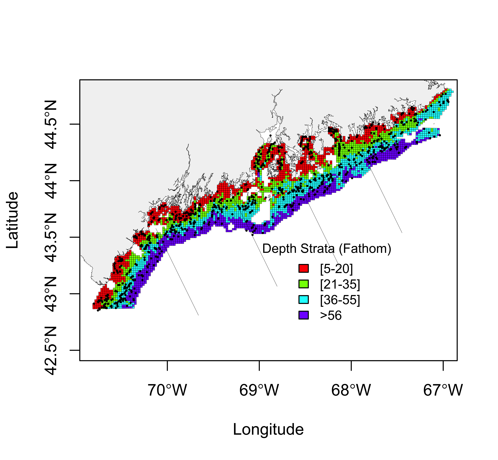

# MSA
Map of study area

## Installation
Install the "remotes" package from CRAN:

```
 install.packages("remotes")
 library("remotes")
```

Please install the MSA package from this GitHub repository using a function in the "remotes" package:

```
remotes::install_github("Bai-Li-2018/MSA", dependencies = TRUE)
library(MSA)
```
## Example
Please confirm that MSA is installed by running the simple example below:

```
## Plot a map of study area with sampling grids
plot_map_grid(map_sp_path = system.file("extdata", "shapefiles", "ME_clip_NAD83.shp", package="MSA"),
              grids_sp_path = system.file("extdata", "shapefiles", "grids2007.shp", package="MSA"),
              xlim=c(-70.8, -67), 
              ylim=c(42.5, 44.8),
              grids_col_var="DEPTH_S",
              grids_col=rainbow(4),
              legend_x = -69, legend_y=43.5,
              legend=c("[5-20]", "[21-35]", "[36-55]", ">56"),
              legend_title = "Depth Strata (Fathom)")

## Add lines to show regions
add_sp(sp_path=system.file("extdata", "shapefiles", "trawl_survey_regions.shp", package="MSA"),
       col="black", border_col="black")

## Add sampling stations
stations <- read.csv(system.file("extdata", "stations.csv", package="MSA"))
add_stations(stations_x=stations$START_LONGITUDE, 
             stations_y=stations$START_LATITUDE, 
             col="black", points_cex=0.3)
```


## Acknowledgements
- All the shapefiles and coordinates of stations are stored in inst/extdata folder.
- ME_clip_NAD83 files are provided by Dr. Jie Cao 
- grids2007 and trawl_survey_regions are provided by Maine Department of Marine Resources (Maine DMR)
- stations.csv contains randomly selected stations from Maine DMR Bottom Trawl Survey
